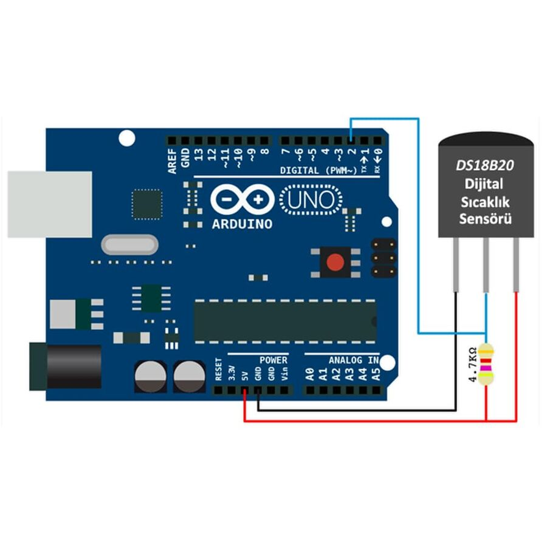

## LANGUAGES:
- [TR](#tr)
- [EN](#EN)

# TR
# Arduino Sensör Kütüphanesi

Bu depo, çeşitli sensörleri yönetmek için bir Arduino kütüphanesi içermektedir. Aşağıda kütüphanenin kullanımı, işlev açıklamaları ve eklenmesi gereken devre şemaları için yerler bulunmaktadır.

---

## İçindekiler

- [Giriş](#giriş)
- [Desteklenen Sensörler](#desteklenen-sensörler)
- [Kurulum](#kurulum)
- [Kullanım](#kullanım)
- [Fonksiyon Açıklamaları](#fonksiyon-açıklamaları)
- [Devre Şemaları](#devre-şemaları)
- [Örnekler](#örnekler)

---

## Giriş

Bu kütüphane, Arduino projelerinde sıkça kullanılan çeşitli sensörlerle çalışmak için basit bir arayüz sağlar. Karmaşık uygulamaları soyutlar ve veri okumak için kolay kullanılabilir fonksiyonlar sunar.

---

## Desteklenen Sensörler

Kütüphane aşağıdaki sensörleri destekler:

1. **DHT11** - Sıcaklık ve nem sensörü.
2. **DS18B20** - Dijital sıcaklık sensörü.
3. **KY Serisi Sensörler:**
   - KY-002: Titreşim sensörü.
   - KY-008: Lazer verici.
   - KY-010: Işık sensörü.
   - KY-013: Sıcaklık sensörü.
   - KY-017: Cıva tilt anahtarı.
   - KY-018: Foto direnç.
   - KY-020: Tilt anahtarı.
   - KY-021: Reed anahtarı.
   - KY-022: Kızılötesi alıcı.
   - Ve diğerleri...
4. **LM35** - Hassas sıcaklık sensörü.
5. **Ultrasonik Mesafe Sensörü (us.h)**.
6. **Nabız Sensörü (nabizmodulu.cpp)**.
7. **Buzzer (buzzer.cpp)**.

---

## Kurulum

1. Bu depoyu klonlayın veya indirin.
2. Kütüphane klasörünü Arduino `libraries` dizinine yerleştirin.
3. Arduino IDE açık ise yeniden başlatın.

---

## Kullanım

1. Arduino skeç dosyanıza istediğiniz sensör dosyasını dahil edin. Örneğin:

   ```cpp
   #include "dht11.cpp"
   #include "us.h"
   ```

2. Sensörü `setup()` fonksiyonunda başlatın.

   ```cpp
   void setup() {
       Serial.begin(9600);
       dht11_init();
   }
   ```

3. Sensörden veri okumak için sağlanan fonksiyonları `loop()` fonksiyonunda kullanın.

   ```cpp
   void loop() {
       float temperature = dht11_readTemperature();
       Serial.println(temperature);
       delay(1000);
   }
   ```

---

## Fonksiyon Açıklamaları

### DHT11 Fonksiyonları
- `void dht11start()` - DHT11 sensörünü başlatır.
- `int readbitdht11()` - bitleri okur.
- `byte readbytedht11()` - byte'leri okur.

### DS18B20 Fonksiyonları
- `ds18b20()` - DS18B20 sensörünü başlatır.
- `float getTemperature()` - Sıcaklık değerini döndürür.

### Ultrasonik Sensör Fonksiyonları
- `void us()` - Ultrasonik sensörü başlatır.
- `float getDistance()` - Mesafeyi santimetre cinsinden ölçer.

### KY Serisi Sensör Fonksiyonları
- **KY-002 (Titreşim Sensörü):**
  - `int ky002deger()` - Titreşim algılanıp algılanmadığını döndürür.
- **KY-008 (Lazer Verici):**
  - `void lazeron()` - Lazer ışığını açar.
  - `void lazeroff()` - Lazer ışığını kapatır.
- **KY-010 (Işık Sensörü):**
  - `void ky010main()` - Işık algılanıp algılanmadığını döndürür.
- **KY-013 (Sıcaklık Sensörü):**
  - `void ky013main()` - Sıcaklık değerini döndürür.
- **KY-017 (Cıva Tilt Anahtarı):**
  - `void ky017fonk()` - Tilt durumunu döndürür.
- **KY-018 (Foto Direnç):**
  - `void ky018fonk()` - Işık yoğunluğunu ölçer.
- **KY-020 (Tilt Anahtarı):**
  - `void ky020fonk()` - Tilt durumunu döndürür.
- **KY-021 (Reed Anahtarı):**
  - `void ky021main()` - Anahtarın kapalı olup olmadığını döndürür.
- **KY-022 (Kızılötesi Alıcı):**
  - `int readSignal()` - Kızılötesi sinyal verilerini okur.
  - `int captureIR()` - Okunan sinyali alır ve değerlendirir.

### LM35 Fonksiyonları
- `float readTempC()` - Hassas sıcaklık ölçümünü döndürür.

### Nabız Sensörü Fonksiyonları
- `int nabizhesaplama()` - Nabız ölçümünü döndürür.

### Buzzer Fonksiyonları
- `void stop()` - Buzzerı kapatır.
- `void beep(pin,frequency,int duration)` - Belirtilen süre boyunca beep sesi çıkarır.

---

## Devre Şemaları

### Örnek: DHT11 Sensörü


### Örnek: Ultrasonik Mesafe Sensörü


### Örnek: DS18B20 Sıcaklık Sensörü



### KY Serisi Sensörler

### Örnek: Buzzer (ky-006) Sensörü


### Örnek: LM35 Sensörü


### Örnek: KY039 Sensörü


### Örnek: KY-031 Sensörü


### Örnek: KY-008 Sensörü


### Örnek: KY-026 Sensörü


### Örnek: KY-002 Sensörü


### Örnek: KY-018 Sensörü


### Örnek: KY-020 Sensörü


### Örnek: KY-017 Sensörü


### Örnek: KY-022 Sensörü


### Örnek: KY-033 Sensörü


### Örnek: KY-027 Sensörü


### Örnek: KY-010 Sensörü


### Örnek: KY-025 Sensörü


### Örnek: KY-032 Sensörü


### Örnek: KY-038 Sensörü


### Örnek: KY-013 Sensörü


### Örnek: KY-021 Sensörü


### Örnek: KY-040 Sensörü


## Örnekler

### Örnek 1: DHT11 ile Sıcaklık Okuma
```cpp
#include "dht11.cpp"

void setup() {
    Serial.begin(9600);
    dht11_init();
}

void loop() {
    float temperature = dht11_readTemperature();
    Serial.println("Sıcaklık: " + String(temperature) + " °C");
    delay(2000);
}
```

### Örnek 2: Ultrasonik Sensör ile Mesafe Ölçümü
```cpp
#include "us.h"

void setup() {
    Serial.begin(9600);
    us_init();
}

void loop() {
    float distance = us_getDistance();
    Serial.println("Mesafe: " + String(distance) + " cm");
    delay(1000);
}
```

### Örnek 3: KY-018 ile Işık Ölçümü
```cpp
#include "ky018.cpp"

void setup() {
    Serial.begin(9600);
}

void loop() {
    int lightIntensity = ky018_getLightIntensity();
    Serial.println("Işık Yoğunluğu: " + String(lightIntensity));
    delay(1000);
}
```

---


# EN
# Arduino Sensor Library

This repository contains an Arduino library for managing various sensors. Below are details about the library's usage, function descriptions, and placeholders for circuit diagrams.

---

## Table of Contents

- [Introduction](#introduction)
- [Supported Sensors](#supported-sensors)
- [Installation](#installation)
- [Usage](#usage)
- [Function Descriptions](#function-descriptions)
- [Circuit Diagrams](#circuit-diagrams)
- [Examples](#examples)

---

## Introduction

This library provides a simple interface to work with commonly used sensors in Arduino projects. It abstracts complex implementations and offers user-friendly functions to read data.

---

## Supported Sensors

The library supports the following sensors:

1. **DHT11** - Temperature and humidity sensor.
2. **DS18B20** - Digital temperature sensor.
3. **KY Series Sensors:**
   - KY-002: Vibration sensor.
   - KY-008: Laser transmitter.
   - KY-010: Light sensor.
   - KY-013: Temperature sensor.
   - KY-017: Mercury tilt switch.
   - KY-018: Photoresistor.
   - KY-020: Tilt switch.
   - KY-021: Reed switch.
   - KY-022: Infrared receiver.
   - And others...
4. **LM35** - Precision temperature sensor.
5. **Ultrasonic Distance Sensor (us.h)**.
6. **Pulse Sensor (nabizmodulu.cpp)**.
7. **Buzzer (buzzer.cpp)**.

---

## Installation

1. Clone or download this repository.
2. Place the library folder in the Arduino `libraries` directory.
3. Restart the Arduino IDE if it is open.

---

## Usage

1. Include the desired sensor file in your Arduino sketch. For example:

   ```cpp
   #include "dht11.cpp"
   #include "us.h"
   ```

2. Initialize the sensor in the `setup()` function.

   ```cpp
   void setup() {
       Serial.begin(9600);
       dht11_init();
   }
   ```

3. Use the provided functions in the `loop()` function to read data from the sensor.

   ```cpp
   void loop() {
       float temperature = dht11_readTemperature();
       Serial.println(temperature);
       delay(1000);
   }
   ```

---

## Function Descriptions

### DHT11 Functions
- `void dht11start()` - Initializes the DHT11 sensor.
- `int readbitdht11()` - Reads bits.
- `byte readbytedht11()` - Reads bytes.

### DS18B20 Functions
- `ds18b20()` - Initializes the DS18B20 sensor.
- `float getTemperature()` - Returns the temperature value.

### Ultrasonic Sensor Functions
- `void us()` - Initializes the ultrasonic sensor.
- `float getDistance()` - Measures the distance in centimeters.

### KY Series Sensor Functions
- **KY-002 (Vibration Sensor):**
  - `int ky002deger()` - Returns whether vibration is detected.
- **KY-008 (Laser Transmitter):**
  - `void lazeron()` - Turns the laser on.
  - `void lazeroff()` - Turns the laser off.
- **KY-010 (Light Sensor):**
  - `void ky010main()` - Returns whether light is detected.
- **KY-013 (Temperature Sensor):**
  - `void ky013main()` - Returns the temperature value.
- **KY-017 (Mercury Tilt Switch):**
  - `void ky017fonk()` - Returns the tilt status.
- **KY-018 (Photoresistor):**
  - `void ky018fonk()` - Measures light intensity.
- **KY-020 (Tilt Switch):**
  - `void ky020fonk()` - Returns the tilt status.
- **KY-021 (Reed Switch):**
  - `void ky021main()` - Returns whether the switch is closed.
- **KY-022 (Infrared Receiver):**
  - `int readSignal()` - Reads infrared signal data.
  - `int captureIR()` - Captures and processes the received signal.

### LM35 Functions
- `float readTempC()` - Returns the precise temperature measurement.

### Pulse Sensor Functions
- `int nabizhesaplama()` - Returns the pulse measurement.

### Buzzer Functions
- `void stop()` - Stops the buzzer.
- `void beep(pin,frequency,int duration)` - Emits a beep sound for the specified duration.

---

## Circuit Diagrams

### Example: DHT11 Sensor


### Example: Ultrasonic Distance Sensor


### Example: DS18B20 Temperature Sensor


### KY Series Sensors

### Example: Buzzer (KY-006) Sensor


### Example: LM35 Sensor


### Example: KY039 Sensor


### Example: KY-031 Sensor


### Example: KY-008 Sensor


### Example: KY-026 Sensor


### Example: KY-002 Sensor


### Example: KY-018 Sensor


### Example: KY-020 Sensor


### Example: KY-017 Sensor


### Example: KY-022 Sensor


### Example: KY-033 Sensor


### Example: KY-027 Sensor


### Example: KY-010 Sensor


### Example: KY-025 Sensor


### Example: KY-032 Sensor


### Example: KY-038 Sensor


### Example: KY-013 Sensor


### Example: KY-021 Sensor


### Example: KY-040 Sensor


---

## Examples

### Example 1: Reading Temperature with DHT11
```cpp
#include "dht11.cpp"

void setup() {
    Serial.begin(9600);
    dht11_init();
}

void loop() {
    float temperature = dht11_readTemperature();
    Serial.println("Temperature: " + String(temperature) + " °C");
    delay(2000);
}
```

### Example 2: Measuring Distance with Ultrasonic Sensor
```cpp
#include "us.h"

void setup() {
    Serial.begin(9600);
    us_init();
}

void loop() {
    float distance = us_getDistance();
    Serial.println("Distance: " + String(distance) + " cm");
    delay(1000);
}
```

### Example 3: Measuring Light Intensity with KY-018
```cpp
#include "ky018.cpp"

void setup() {
    Serial.begin(9600);
}

void loop() {
    int lightIntensity = ky018_getLightIntensity();
    Serial.println("Light Intensity: " + String(lightIntensity));
    delay(1000);
}
```

---
```
